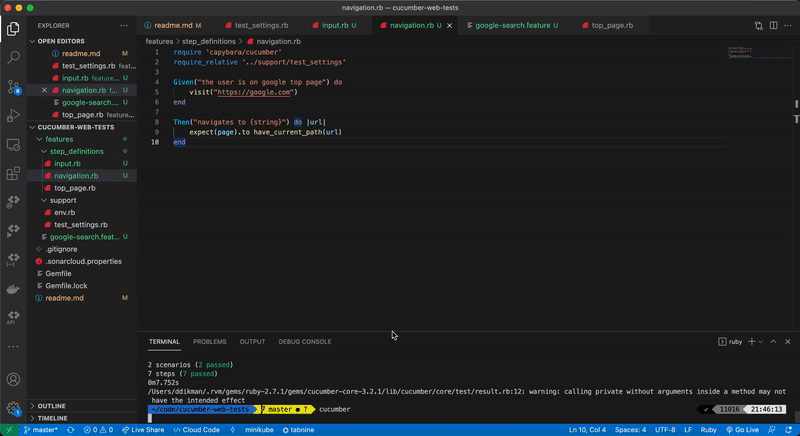
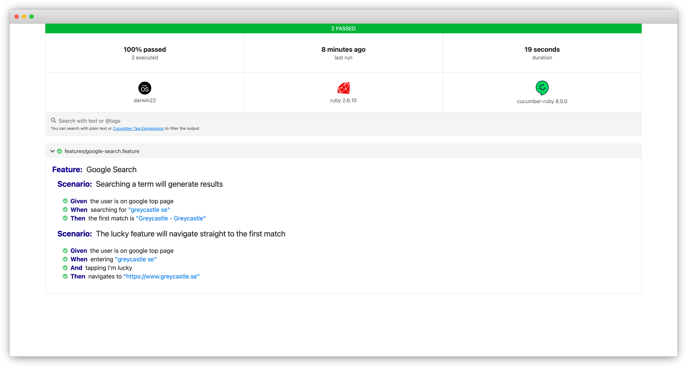

# Web testing with Cucumber and Capybara

This project is a small example to show how web testing can be automated with Cucumber and Capybara.


## Setup

```bash
rvm install 2.6.0
bundle install
```

[rvm](https://rvm.io/) is the Ruby Version Manager and helps you keep your environment clean.

## Run

```bash
cucumber features
```



## Reporting

By default cucumber reports to the console. You can change this by using a reporter

```bash
cucumber features --format html > report.html
```



## Add more tests

Create a new `x.feature` file in the `features` folder and then add in a scenario.

Then run `cucumber -d` to get example step definitions, paste and modify these into step definitions.

## Using Capybara
Capybara isn't just a cute animal, it's also a framework for driving UI tests with Selenium. Check out the [cheat sheet](https://gist.github.com/zhengjia/428105) for a quick guide into how to use it.

## Headless tests

Tests are only useful when they are being run continously. This repository relies on Github Actions to run tests on commit. Read more [on how to run selenium headless](https://www.linkedin.com/pulse/running-selenium-web-tests-github-actions-moataz-nabil/) (without UI) in a continous integration environment like Github Actions.