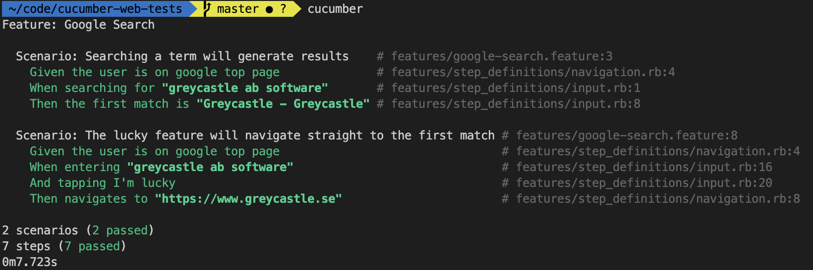

# Web testing with Cucumber and Capybara

This project is a small example to show how web testing can be automated with Cucumber and Capybara.



## Setup

```bash
rvm install 2.6.0
bundle install
```

## Run

```bash
cucumber features
```


## Add more tests

Create a new `x.feature` file in the `features` folder and then add in a scenario.

Then run `cucumber -d` to get example step definitions, paste and modify these into step definitions.

## Using Capybara
Capybara isn't just a cute animal, it's also a framework for driving UI tests with Selenium. Check out the [cheat sheet](https://gist.github.com/zhengjia/428105) for a quick guide into how to use it.